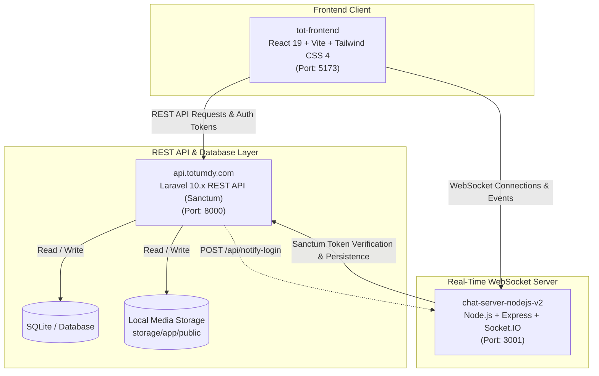
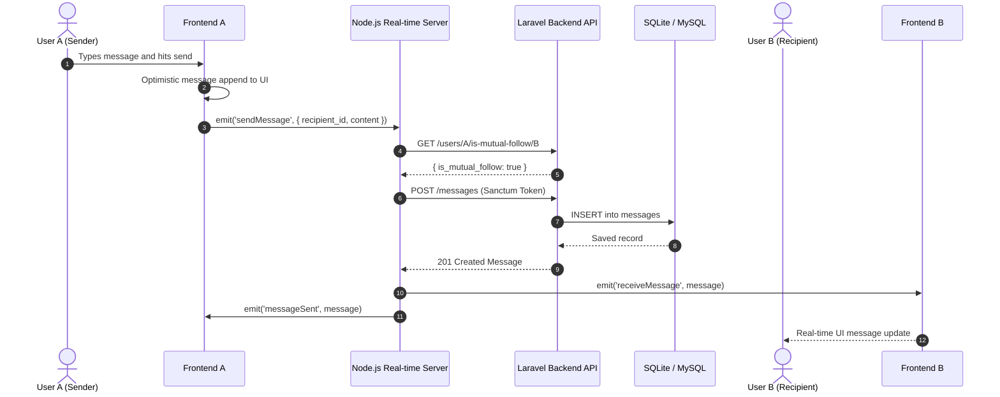
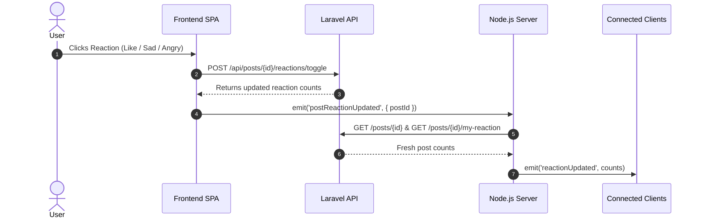

# Comprehensive Project Analysis: TrendsOfTUM-2025 (TOTv2)

TrendsOfTUM-2025 is a full-stack, real-time social networking web platform built for university campus communities. It combines a custom **Glassmorphism UI** with a decoupled, tri-tier architecture.

---

## 1. High-Level Architecture Overview

The system consists of three independent, decoupled components:



---

## 2. Directory Structure & Stack Details

```
TrendsofTUM_2025/
├── api.totumdy.com/          # Laravel 10 REST API Backend
│   ├── app/
│   │   ├── Http/Controllers/API/
│   │   │   ├── AuthController.php
│   │   │   ├── CommentController.php
│   │   │   ├── FollowController.php
│   │   │   ├── MediaController.php
│   │   │   ├── MessageController.php
│   │   │   ├── PostController.php
│   │   │   ├── ReactionController.php
│   │   │   └── UserReportController.php
│   │   └── Models/
│   │       ├── Comment.php
│   │       ├── Follow.php
│   │       ├── Message.php
│   │       ├── Post.php
│   │       ├── Reaction.php
│   │       ├── User.php
│   │       └── UserReport.php
│   ├── config/
│   │   ├── cors.php
│   │   └── sanctum.php
│   ├── database/migrations/
│   └── routes/api.php
│
├── chat-server-nodejs-v2/     # Node.js Socket.IO Real-Time Server
│   ├── package.json
│   └── server.js
│
└── tot-frontend/             # React 19 + Vite Frontend SPA
    ├── src/
    │   ├── api/
    │   │   ├── apiClient.js
    │   │   ├── authService.js
    │   │   └── postService.js
    │   ├── components/
    │   │   ├── auth/ (Login, Register, PasswordResetRequest, ReportUser)
    │   │   ├── chat/ (Chat)
    │   │   ├── common/ (AvatarWithDot)
    │   │   ├── feed/ (Feed, Post, CreatePostForm, PostCardStatic)
    │   │   ├── layout/ (Header, Footer, Layout)
    │   │   └── profile/ (ProfileView, EditProfile, UserList, UserGrid)
    │   ├── config/categories.js
    │   ├── App.jsx
    │   └── main.jsx
    └── vite.config.js
```

---

## 3. Sub-System In-Depth Analysis

### 3.1. Frontend (`tot-frontend`)
* **Framework**: React 19.1.1 with Vite 7.1.0 and Tailwind CSS 4.1.14.
* **Routing Strategy**: Single-page state-driven routing located inside `App.jsx` using `currentView` (`feed`, `profile`, `editProfile`, `chat`) and `extraView` (`passwordResetRequest`, `reportUser`).
* **State Management**: React local hooks (`useState`, `useEffect`, `useCallback`, `useRef`).
* **HTTP Client**: Axios with Bearer token request interceptor and 401 response redirect handler.
* **Design Theme**: Custom Glassmorphism aesthetic utilizing CSS backdrop filters (`backdrop-blur`), subtle white translucent borders, soft pastel palette, and playful custom typography (`Chicle`, `Cherry Bomb`, `Balthazar`).

### 3.2. Backend API (`api.totumdy.com`)
* **Framework**: Laravel 10.x, PHP 8.1+.
* **Authentication**: Laravel Sanctum bearer tokens.
* **Business Policies & Validations**:
  * Registration restricted to `@tot.com` university email addresses.
  * Password strength enforcement (minimum 8 chars, uppercase, lowercase, digit, and special character).
  * Media upload validation supporting images, video, and audio up to 20MB with MIME inspection.
  * Post creation requires either body text or media, with category selection (`memes`, `study`, `entertainment`, `announcement`, `news`).
  * Mutual-follow enforcement before private messaging is permitted.

### 3.3. Real-Time Server (`chat-server-nodejs-v2`)
* **Framework**: Node.js with Express 5.1.0 and Socket.IO 4.8.1.
* **Authentication**: Socket middleware (`io.use`) intercepts handshakes and validates the Sanctum bearer token against Laravel's `/api/user` endpoint.
* **Presence Management**: Multi-tab tracking using `Map<userId, Set<socketId>>` to broadcast `userOnline` and `userOffline` transitions accurately.
* **Event Handlers**:
  * `postReactionUpdated`: Broadcasts updated reaction tallies.
  * `postCommentAdded`: Emits live comments across clients.
  * `sendMessage`: Verifies mutual follow with Laravel backend, persists message, and emits to all active recipient sockets.

---

## 4. Key Workflows & Interaction Diagrams

### Real-Time Chat Workflow (Mutual Followers Only)



### Post Reactions & Live Comments Workflow



---

## 5. API Endpoints Reference

| Method | Endpoint | Auth | Purpose |
| :--- | :--- | :--- | :--- |
| `POST` | `/api/register` | No | Register new user (`@tot.com` required) |
| `POST` | `/api/login` | No | User login & token generation |
| `POST` | `/api/logout` | Sanctum | Revoke current access token |
| `GET` | `/api/user` | Sanctum | Get authenticated user |
| `POST` | `/api/user/update` | Sanctum | Update user name & avatar |
| `GET` | `/api/users` | Sanctum | Get all users with `is_following` status |
| `GET` | `/api/users/{user}/is-mutual-follow/{otherUser}` | Sanctum | Check bidirectional follow status |
| `GET` | `/api/posts` | Sanctum | Paginated/full post feed with counts |
| `POST` | `/api/posts` | Sanctum | Create post with optional media & category |
| `DELETE` | `/api/posts/{post}` | Sanctum | Author-only post deletion |
| `POST` | `/api/posts/{post}/share` | Sanctum | Reshare an existing post |
| `POST` | `/api/media/upload` | Sanctum | Upload image, video, or audio (max 20MB) |
| `POST` | `/api/follow/{user}` | Sanctum | Follow user |
| `POST` | `/api/unfollow/{user}` | Sanctum | Unfollow user |
| `GET` | `/api/followers/{user}` | Sanctum | Paginated followers list |
| `GET` | `/api/following/{user}` | Sanctum | Paginated following list |
| `POST` | `/api/posts/{post}/reactions/toggle` | Sanctum | Toggle reaction (Like, Sad, Angry) |
| `GET` | `/api/posts/{post}/my-reaction` | Sanctum | Retrieve current user's reaction |
| `GET` | `/api/posts/{post}/comments` | Sanctum | List comments for a post |
| `POST` | `/api/posts/{post}/comments` | Sanctum | Add comment to a post |
| `GET` | `/api/messages/{userId}` | Sanctum | Fetch 1-on-1 chat history |
| `POST` | `/api/messages` | Sanctum | Send new message |
| `POST` | `/api/submit-user-report` | Sanctum | Submit moderation report against a user |

---

## 6. Identified Issues & Recommendations

### 1. Missing Backend Route for Password Reset Request
* **Issue**: The frontend [`PasswordResetRequest.jsx`](file:///c:/Users/stephen/Desktop/TOT/TrendsofTUM_2025/tot-frontend/src/components/auth/PasswordResetRequest.jsx) and [`authService.js`](file:///c:/Users/stephen/Desktop/TOT/TrendsofTUM_2025/tot-frontend/src/api/authService.js) dispatch requests to `POST /api/submit-password-reset-request`, but this route is missing from `routes/api.php`.
* **Fix**: Implement a `PasswordResetRequestController` with validation and mailer integration, and register `Route::post('/submit-password-reset-request', ...)` in `api.php`.

### 2. CORS Path String Whitespace
* **Issue**: In `api.totumdy.com/config/cors.php`, line 18 contains `'    storage/*'`.
* **Fix**: Remove leading spaces to prevent potential cross-origin media loading issues:
  ```php
  'paths' => ['api/*', 'sanctum/csrf-cookie', 'storage/*'],
  ```

### 3. Frontend Architecture & Monolithic State
* **Issue**: `App.jsx` spans >800 lines and coordinates authentication, routing state, data fetching, WebSocket listener lifecycles, and view switching.
* **Fix**:
  * Adopt `react-router-dom` for URL-driven routing (`/feed`, `/chat/:userId`, `/profile/:userId`).
  * Extract WebSocket logic into a custom `useSocket` hook or React Context.

### 4. Storage Orphan Cleanup
* **Issue**: Deleting posts in `PostController@destroy` removes the database record but does not unlink uploaded media files from `storage/app/public/uploads/`.
* **Fix**: Call `Storage::disk('public')->delete(...)` inside `PostController@destroy` and `AuthController@updateProfile`.

### 5. Horizontal Scaling for WebSockets
* **Issue**: `chat-server-nodejs-v2` holds connected socket IDs in memory (`connectedUsers = new Map()`).
* **Fix**: When scaling past a single Node instance, integrate Redis Pub/Sub using `@socket.io/redis-adapter` and Redis key-value storage for user presence.

---

*Generated for TrendsOfTUM-2025 Project Codebase.*
