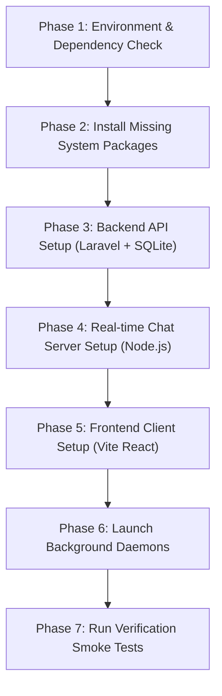

# 🤖 OpenCode AI Agent Playbook: Local Server Setup & Execution

> **AGENT DIRECTIVE**: This document is an automated execution runbook for **OpenCode** (and peer AI coding assistants) to provision, configure, serve, and verify the full-stack **TrendsOfTUM-2025** social media application from scratch on any operating system.

---

## 🎯 Target System State

You must bring the application to the following operational state:

| Subsystem | Working Directory | Target Port / Protocol | Health Check / Smoke Test |
| :--- | :--- | :--- | :--- |
| **Backend REST API** | `api.totumdy.com/` | `http://127.0.0.1:8000` | `GET /api/posts` returns HTTP 401 JSON |
| **Real-Time Chat Server** | `chat-server-nodejs-v2/` | `http://localhost:3001` | `GET /socket.io/?EIO=4&transport=polling` returns `sid` |
| **Frontend Web App** | `tot-frontend/` | `http://localhost:5173` | `GET /` returns HTTP 200 HTML |
| *(Optional) Custom Domain* | Workspace Root | `https://totumdy.com` | Caddy + Cloudflare Tunnel `tot-server` |

---

## 🧭 Execution Workflow for OpenCode Agent



---

## 📋 Phase 1: Environment & Dependency Check

Run these non-interactive commands to verify whether the host machine has the required toolchains:

```bash
# Check runtime binaries
git --version
node -v
npm -v
php -v
composer --version

# Check required PHP extensions (pdo_sqlite, sqlite3, curl, fileinfo, gd, openssl, mbstring, zip)
php -m
```

---

## 📦 Phase 2: Install Missing System Packages (If Missing)

If any prerequisite is missing on a fresh laptop, run the appropriate non-interactive OS install commands:

### 🪟 Windows (PowerShell with WinGet)
```powershell
# Install Node.js LTS, PHP 8.2, Composer, and Git non-interactively
winget install --id Git.Git -e --source winget --accept-source-agreements --accept-package-agreements
winget install --id OpenJS.NodeJS.LTS -e --source winget --accept-source-agreements --accept-package-agreements
winget install --id PHP.PHP.8.2 -e --source winget --accept-source-agreements --accept-package-agreements
winget install --id Composer.Composer -e --source winget --accept-source-agreements --accept-package-agreements

# Ensure required extensions are active in php.ini:
# (pdo_sqlite, sqlite3, curl, fileinfo, gd, openssl, mbstring, zip)
```

> ⚠️ **Windows OpenCode Notice**: Always execute `npm.cmd` / `npx.cmd` instead of `npm` / `npx` in PowerShell to bypass the script execution policy (`npm.ps1 cannot be loaded`).

### 🍏 macOS (Homebrew)
```bash
brew install git node php@8.2 composer
brew link --force --overwrite php@8.2
```

### 🐧 Linux (Ubuntu / Debian)
```bash
sudo apt-get update && sudo apt-get install -y curl git unzip software-properties-common
sudo add-apt-repository -y ppa:ondrej/php && sudo apt-get update
sudo apt-get install -y php8.2-cli php8.2-sqlite3 php8.2-curl php8.2-mbstring php8.2-xml php8.2-zip php8.2-gd php8.2-fileinfo
curl -fsSL https://deb.nodesource.com/setup_20.x | sudo -E bash -
sudo apt-get install -y nodejs
curl -sS https://getcomposer.org/installer | php && sudo mv composer.phar /usr/local/bin/composer
```

---

## 🛠️ Phase 3: Setup Backend API (`api.totumdy.com`)

Execute in `api.totumdy.com/`:

```bash
cd api.totumdy.com

# 1. Install PHP dependencies
composer install --no-interaction --prefer-dist --optimize-autoloader

# 2. Setup Environment Variables (.env)
# Create .env if missing and ensure DB_CONNECTION=sqlite and local URLs are configured
```

**Required `.env` content for `api.totumdy.com`:**
```dotenv
APP_NAME=TrendsOfTUM
APP_ENV=local
APP_KEY=base64:2hvc/7fhjawRfHbOAXT5nsm8Ly8Dw0BL8GZuCiCEXnU=
APP_URL=http://127.0.0.1:8000

LOG_CHANNEL=stack
LOG_LEVEL=debug

DB_CONNECTION=sqlite

FILESYSTEM_DISK=public
QUEUE_CONNECTION=sync
SESSION_DRIVER=file
SESSION_LIFETIME=120

FRONTEND_URL=http://localhost:5173
SANCTUM_STATEFUL_DOMAINS=totumdy.com,api.totumdy.com,chat.totumdy.com,localhost,localhost:5173,127.0.0.1,127.0.0.1:8000,127.0.0.1:5173
SESSION_DOMAIN=localhost
NODE_SERVER_KEY=secret-tot-key
```

```bash
# 3. Generate key if needed
php artisan key:generate --force

# 4. Ensure SQLite database file exists
mkdir -p database
touch database/database.sqlite

# 5. Run Database Migrations & Seeders
php artisan migrate --seed --force

# 6. Create Storage Symlink (CRITICAL for images/audio/video uploads)
php artisan storage:link --force

cd ..
```

---

## 💬 Phase 4: Setup Real-Time Chat Server (`chat-server-nodejs-v2`)

Execute in `chat-server-nodejs-v2/`:

```bash
cd chat-server-nodejs-v2

# 1. Install Node dependencies
npm install --no-audit --no-fund
# (On Windows: npm.cmd install --no-audit --no-fund)

# 2. Configure .env
```

**Required `.env` content for `chat-server-nodejs-v2`:**
```dotenv
PORT=3001
NODE_SERVER_KEY=secret-tot-key
```

```bash
cd ..
```

---

## 🎨 Phase 5: Setup Frontend Client (`tot-frontend`)

Execute in `tot-frontend/`:

```bash
cd tot-frontend

# 1. Install npm dependencies
npm install --no-audit --no-fund
# (On Windows: npm.cmd install --no-audit --no-fund)

# 2. Test build integrity
npm run build
# (On Windows: npm.cmd run build)

cd ..
```

---

## 🚀 Phase 6: Launch All 3 Background Services

OpenCode should launch each process in the background / separate tasks:

### Service 1: Laravel API Backend
- **CWD**: `api.totumdy.com`
- **Command**: `php artisan serve --host=127.0.0.1 --port=8000`
- **Log Verification**: Must output `Server running on [http://127.0.0.1:8000]`

### Service 2: Socket.IO Chat Server
- **CWD**: `chat-server-nodejs-v2`
- **Command**: `node server.js`
- **Log Verification**: Must output `[Server] Running on port 3001`

### Service 3: React Vite Frontend Dev Server
- **CWD**: `tot-frontend`
- **Command**: `npx vite --host` *(Windows: `npx.cmd vite --host`)*
- **Log Verification**: Must output `VITE ready ... Local: http://localhost:5173/`

---

## 🌐 Optional: Custom Domain & Cloudflare Tunnel (`totumdy.com`)

To serve via domain `https://totumdy.com`:

```bash
# Service 4: Cloudflare Tunnel
cloudflared tunnel run tot-server

# Service 5: Caddy Reverse Proxy (HTTPS)
caddy run --config Caddyfile
```

---

## 🧪 Phase 7: Automated Verification & Smoke Tests

Run these assertions to verify full-stack operational readiness:

### 1. Test Vite Frontend
```powershell
# PowerShell
(Invoke-WebRequest -Uri "http://localhost:5173" -UseBasicParsing).StatusCode
# Expected output: 200
```
```bash
# Bash
curl -s -I http://localhost:5173 | grep "200 OK"
```

### 2. Test Laravel API
```powershell
# PowerShell
(Invoke-WebRequest -Uri "http://127.0.0.1:8000/api/posts" -Headers @{"Accept"="application/json"} -UseBasicParsing -SkipHttpErrorCheck).StatusCode
# Expected output: 401 (Sanctum unauthenticated response)
```
```bash
# Bash
curl -s -I -H "Accept: application/json" http://127.0.0.1:8000/api/posts | grep "401"
```

### 3. Test Authentication Endpoint with Demo Account
```powershell
# PowerShell
Invoke-RestMethod -Uri "http://127.0.0.1:8000/api/login" -Method Post `
  -Headers @{ "Accept"="application/json"; "Content-Type"="application/json" } `
  -Body '{"email":"porter98@example.org","password":"password"}'
# Expected output: JSON object containing user info and bearer token
```

### 4. Test Real-Time WebSocket Handshake
```powershell
# PowerShell
(Invoke-WebRequest -Uri "http://localhost:3001/socket.io/?EIO=4&transport=polling" -UseBasicParsing).Content
# Expected output contains: "sid":"...", "pingInterval":10000
```

---

## 🔑 Default Test Accounts (Pre-Seeded)

| Email | Password | Details |
| :--- | :--- | :--- |
| `porter98@example.org` | `password` | Seeded Demo User |
| `rgibson@example.org` | `password` | Seeded Demo User |
| `lyundt@example.net` | `password` | Seeded Demo User |

---

## 🩹 Agent Self-Healing & Troubleshooting Guide

| Issue Encountered | Root Cause | OpenCode Automated Fix |
| :--- | :--- | :--- |
| `npm.ps1 cannot be loaded... execution policy` | PowerShell script restriction on Windows | Replace `npm` / `npx` with `npm.cmd` / `npx.cmd` in all tool calls. |
| `could not find driver (SQL: select * from users)` | Missing PHP SQLite extension | Enable `extension=pdo_sqlite` and `extension=sqlite3` in `php.ini`. |
| `Port 8000 / 3001 / 5173 is already in use` | Zombie or lingering processes from previous session | Run `Stop-Process -Name node, php -Force` (Windows) or `pkill -f 'node\|artisan'` (Linux/macOS). |
| Uploaded images or user avatars return 404 | Missing public storage symlink | Run `php artisan storage:link --force` in `api.totumdy.com`. |
| API returns 500 `Route [login] not defined` | Missing `Accept: application/json` header | Ensure HTTP requests pass header `Accept: application/json` to receive 401 JSON instead of redirect. |
| Real-time chat messages fail to deliver | Secret key mismatch or Node server down | Confirm `chat-server-nodejs-v2` is running on port 3001 and `NODE_SERVER_KEY=secret-tot-key` matches in both `.env` files. |
